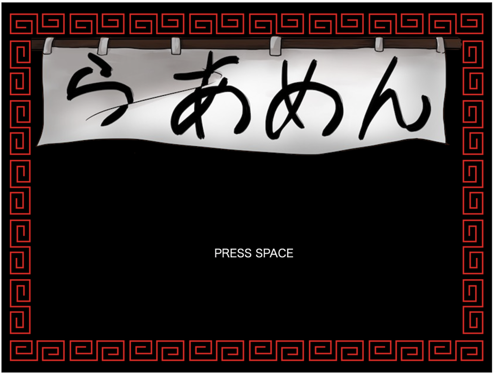
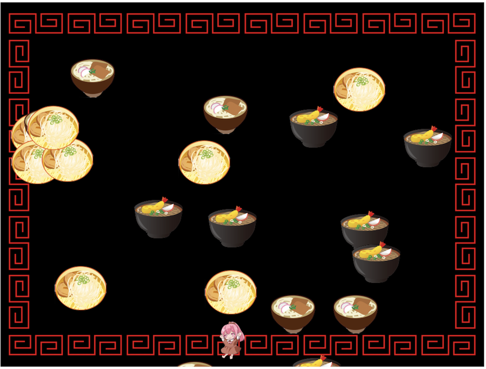
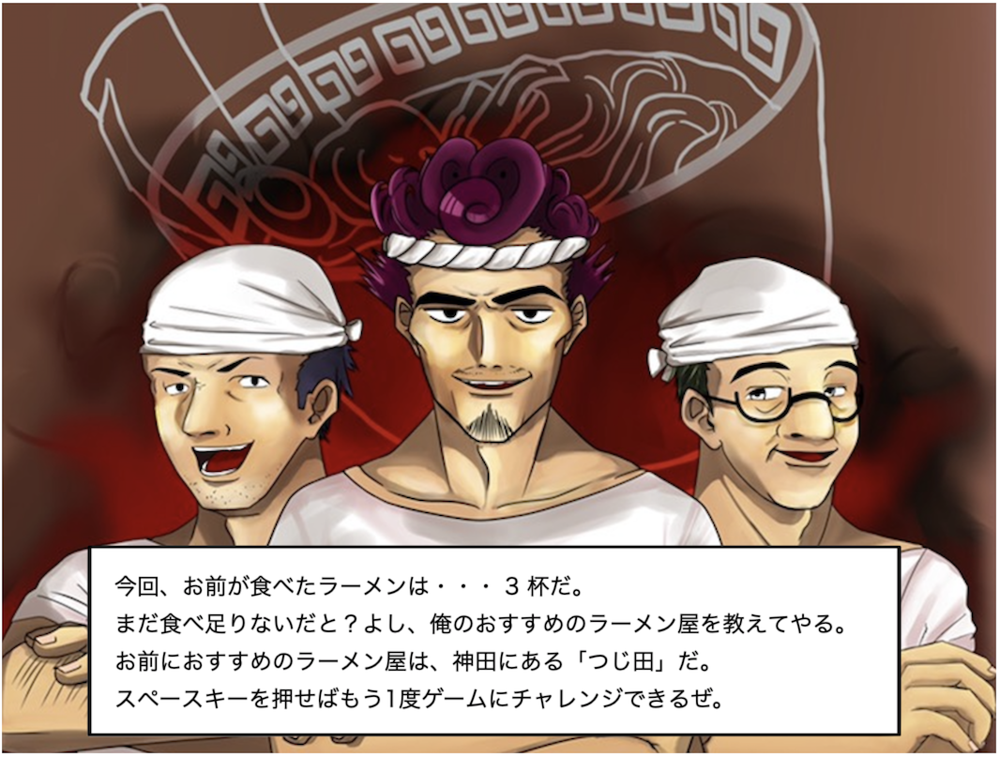

# Rubyで作るブラウザゲーム
## 1. はじめに
今回はRubyでブラウザゲームを作ります。ゲームの内容は、上からうどん・そば・ラーメンが落ちてくるので、その中からひたすらラーメンだけを食べ続けるというものです。ラーメン以外を食べた時点でゲームオーバーとなります。次にRubyを選定した理由ですが、ただ単に私がRubyでゲームを作ってみたかったからです。また、最近、未経験からエンジニアを目指す人が最初に学ぶ言語としてRubyが人気だと感じているので、需要もあるのではと思いました。最後に、本書の難易度は低いと思いますので、私のような駆け出しエンジニアの人にこそぜひ手にとってもらいたいと思っています。<br>

## 2. 環境構築
### 2.1 Rubyのインストール
今回のゲームはRubyで作成するため、ネットの記事を参考にRubyをインストールしてください。<br>

<br>

### 2.2 DxOpalのインストール
次に、今回利用するライブラリをインストールしましょう。Rubyのインストールが完了している状況で、ターミナルで以下のコマンドを実行してください。<br>
``` ruby
$ gem install dxopal
```

<br>

### 2.3 作業ディレクトリの作成
以下のコマンドで作業ディレクトリを作成し、作業ディレクトリに移動しましょう。<br>
``` ruby
$ mkdir ruby_game
$ cd ruby_game
```
<br>

### 2.4 必要ファイルのダウンロード
今回のゲームに必要な画像ファイルと音声ファイルを[https://12.gigafile.nu/1031-dc993e8c4ba5a5d3966366fd050055584](https://12.gigafile.nu/1031-dc993e8c4ba5a5d3966366fd050055584)からダウンロードしておいてください。ダウンロードの期限は10月31日まで、ダウンロードキーは0922です。また、完成形のソースコードもこちらに入れておりますので、必要な方はご確認ください。QRコードからもアクセスできます。<br>


## 3.  実装
まずは、雛形を作成しブラウザ上で動作することを確認しましょう。<br>

### 3.1 雛形の作成
初めに以下のコマンドを作業ディレクトリで実行し、雛形を作成します。<br>
``` ruby
$ dxopal init
```
上記のコマンドにより以下のファイルが生成されます。<br>
- dxopal.min.js<br>
- index.html<br>
- main.rb<br>

次に以下のコマンドでサーバーを起動しましょう。<br>
``` ruby
$ dxopal server
```
<div class="page"/>

<br>

最後にブラウザで以下にアクセスし動作を確認してください。<br>
``` ruby
localhost:7521/index.html
```
真っ黒の画面の橋に「Hello!」と表示されていれば成功です。<br>
最後に先ほどダウンロードしたフォルダ内の `images/` と `sounds/` を作業ディレクトリにコピーしておいてください。<br><br>

### 3.2 タイトル画面の作成
それでは、タイトル画面の作成に移ります。背景画像とのれんの画像と文字列を描写します。main.rbを以下のように変更します。
``` ruby
# 画像の登録
Image.register(:bg, 'images/background_image.png')
Image.register(:title, 'images/title.png')

# 画面サイズの設定
Window.width = 1060
Window.height = 800

Window.load_resources do
  Window.loop do
    # 画像と文字列の描写
    Window.draw(0,0, Image[:bg])
    Window.draw(65, 70, Image[:title])
    Window.draw_font((Window.height / 2) + 60, Window.width / 2, "PRESS SPACE", Font.default)
  end
end
```

<br>
ここまで終わった時点で画面は以下のようになっていれば大丈夫です。
<br>



<div class="page"/>

<br>

### 3.3 シーン分けの設定
次にゲームのシーンを設定します。今回は「タイトル」「プレイ中」「ゲームオーバー」と3種類のシーンを設定することにしましょう。また「タイトル」から「プレイ中」と「ゲームオーバー」から「プレイ中」へはスペースキーを押すことでシーン移動ができるよう設定します。main.rbを以下のように変更します。
``` ruby
require 'dxopal'
include DXOpal

〜省略〜

# ゲームの情報を保時
GAME_INFO = {
  scene: :title
}

Window.load_resources do
  Window.loop do
    Window.draw(0,0, Image[:bg])  # 背景画像は常に描写

    case GAME_INFO[:scene]
    when :title
      # 画像と文字列の描写
      Window.draw(65, 70, Image[:title])
      Window.draw_font((Window.height / 2) + 60, Window.width / 2, "PRESS SPACE", Font.default)

      # スペースキーが押されたらシーンを変える
      if Input.key_push?(K_SPACE)
        GAME_INFO[:scene] = :playing
      end

    when :playing

    when :game_over
      # スペースキーが押されたらシーンを変える
      if Input.key_push?(K_SPACE)
        GAME_INFO[:scene] = :playing
      end
    end
  end
end
```

<br>

### 3.4 アイテムの表示
続いて、プレイ中に上から落下してくるアイテムを表示します。まずはこれまでと同様に画像の登録を行います。以下のコードを追記してください。
``` ruby
Image.register(:ramen, 'images/ra-men.png')
Image.register(:udon, 'images/udon.png')
Image.register(:soba, 'images/soba.png')
```

<br>

次にアイテムを表示させるためのクラスを作成します。DxRubyにはSpriteクラスが用意されているため、こちらを継承しておくことで後ほど当たり判定などが簡単に実装できるようになります。<br>
では早速Itemクラスを作成しましょう。
``` ruby
class Item < Sprite
  def initialize(image)                   # 画像を引数に取る
    x = rand(Window.width - image.width)  # x座標はランダムに設定される
    y = 0
    super(x, y, image)
    @speed_y = rand(5) + 10               # 落ちる速度をランダムで決める
  end

  def update
    self.y += @speed_y                    # 落下速度の設定
    if self.y > Window.height             # 画面外に出たら
      self.vanish
    end
  end
end
```

<div class="page"/>

<br>

アイテムを表すItemクラスを作成したら、Itemクラスを継承した各アイテムクラスを作成します。具体的には「ラーメン」「うどん」「そば」が各アイテムになります。

``` ruby
class Ramen < Item
  def initialize
    super(Image[:ramen])
  end
end
```

<br>

``` ruby
class Soba < Item
  def initialize
    super(Image[:soba])
  end
end
```

<br>

``` ruby
class Udon < Item
  def initialize
    super(Image[:udon])
  end
end
```

<br>

最後に、これらのアイテムを管理するためのItemsクラスを作成します。

<br>

``` ruby
# アイテムを管理するクラス
class Items

  def initialize
    @items = []
    @item_count = 10
  end

  def update
    @items.each { |item| item.update }  # 各スプライトのupdateメソッドを呼ぶ
    Sprite.clean(@items)　　             # vanishしたスプライトを配列から取り除く

    (item_count - @items.size).times do  # 自動的にアイテム数を増やす
      i = rand(1..100)
      # ランダムでアイテムが追加される
      if i < 34
        @items.push(Ramen.new)
      elsif i > 34 && i < 67
        @items.push(Udon.new)
      else
        @items.push(Soba.new)
      end
    end
  end

  def draw
    Sprite.draw(@items)   # 各スプライトのdrawメソッドを呼ぶ
  end

  def item_count
    @item_count += 0.005
  end
end
```

<div class="page"/>
<br>

main.rbは以下のようになります。

``` ruby
require 'dxopal'
include DXOpal

# 画像の登録
〜省略〜

# 画面サイズの設定
〜省略〜

# ゲームの情報を保時
〜省略〜

class Item < Sprite
〜省略〜
end

class Ramen < Item
〜省略〜
end

class Soba < Item
〜省略〜
end

class Udon < Item
〜省略〜
end

# アイテムを管理するクラス
class Items
〜省略〜
end

Window.load_resources do

  @items = Items.new

  Window.loop do

    〜省略〜

    when :playing
      @items.update
      @items.draw

    〜省略〜

    end
  end
end
```

<br>

### 3.5 プレイヤーの表示
続いて、アイテムをゲットするプレイヤーを表示させます。まずは画像を登録しましょう。
``` ruby
Image.register(:player, 'images/player.png')
```

<div class="page"/>

画像の登録が完了したらPlayerクラスを作成します。PlayerクラスはItemsクラスの下に追記してください。
``` ruby
class Player < Sprite
  def initialize
    x = Window.width / 2      # X座標の設定
    y = Window.height - 100   # Y座標の設定
    image = Image[:player]    # 画像の設定
    super(x, y, image)
  end

  # キーボードでプレイヤーを移動。画面外に移動しないよう条件を追加。
  def update
    if Input.key_down?(K_LEFT) && self.x > 0
      self.x -= 12
    end
    if Input.key_down?(K_RIGHT) && self.x < (Window.width - Image[:player].width)
      self.x += 12
    end
    if Input.key_down?(K_UP) && self.y > 0
      self.y -= 8
    end
    if Input.key_down?(K_DOWN)  && self.y < (Window.height - Image[:player].height)
      self.y += 8
    end
  end
end
```
最後に作成したPlayerを画面に描写しましょう。main.rbのプレイ中のシーンを以下のように変更します。
``` ruby
when :playing
  @player.update
  @player.draw

  @items.update
  @items.draw
```
これで画面上にプレイヤーが表示されました。またキーボードでプレイヤーを動かすことができます。



<div class="page"/>

<br>

### 3.6 当たり判定の設定
次に当たり判定を実装しましょう。当たり判定は、Spriteクラスに用意されているので簡単に実装できます。<br>
まず、Playerクラスに以下の記述を追加し、当たり判定の範囲を指定します。
``` ruby
class Player < Sprite
  def initialize
    〜省略〜
    # 当たり判定を円の実装（X軸の中心, Y軸の中心, 半径）
    self.collision = [image.width / 2, image.height / 2, 16]
  end
```
Ramen, Soba, Udonクラスのinittializeは以下のように設定します。
``` ruby
  def initialize
    super(Image[:soba])
    self.collision = [image.width / 2, image.height / 2, 56]
  end
```
次にスコアを保存するためにゲーム情報を保持するハッシュを編集します。
``` ruby
GAME_INFO = {
  scene: :title,
  score: 0
}
```

続いて、衝突時に鳴らす効果音を登録しましょう。画像の登録のすぐ下あたりに以下の記述を追加してください。
``` ruby
Sound.register(:success, 'sounds/success.wav')
Sound.register(:failure, 'sounds/failure.wav')
```

最後にhitメソッドを実装します。Ramenクラスは以下のようにします。
``` ruby
  def hit
    Sound[:success].play      # 効果音を鳴らす
    self.vanish               # 画面から除去するためにvanishメソッドを呼ぶ
    GAME_INFO[:score] += 1    # スコアをプラス
  end
```

SobaクラスとUdonクラスは以下のようにします。
``` ruby
  def hit
    Sound[:failure].play            # 効果音を鳴らす
    self.vanish                     # 画面から除去するためにvanishメソッドを呼ぶ
    GAME_INFO[:scene] = :game_over  # シーンの切り替え
  end
```

最後にItemsクラスを編集し、当たり判定を実行させるようにしましょう。
``` ruby
  def update(player)                    # playerを引数にとるように修正
    @items.each { |item| item.update }  # 各スプライトのupdateメソッドを呼ぶ
    Sprite.check(player, @items)        # ここで当たり判定を実行。当たっていた場合はhitメソッドが呼ばれる。
    Sprite.clean(@items)                # vanishしたスプライトを配列から取り除く
    〜省略〜
```

<div class="page"/>

<br>

updateメソッドを更新したので、引数を追加しておきましょう。
``` ruby
〜省略〜
when :playing
  @items.update(@player)
```

<br>

### 3.7 ゲームオーバー画面の作成
現在、うどんかそばに当たってしまうと真っ黒な画面に切り替わります。このままでは少しゲームとして味気ないので、ここにゲームオーバー画面を作成していきましょう。具体的には、今回食べることができたラーメンの数と、おすすめのラーメン屋を表示します。

それではまず、画像を登録しましょう

``` ruby
Image.register(:result, 'images/result.png')
```

続いて登録した画像を描写します。

``` ruby
when :game_over
  Window.draw(0, 0, Image[:result])
```

次にリザルト画面で表示させるためのおすすめのラーメン屋リストを作成しましょう。GAME_INFOの下に以下の2次元配列を定義します。ただの2次元配列なので、表示数を増やしたい場合はこのリストに追加していきましょう。

``` ruby
# おすすめラーメン店リスト
SHOP_LIST = [
  ["中野", "二代目えん寺"],["歌舞伎町", "ラーメン二郎"],["小滝橋通", "龍の家"],
  ["秋葉原", "MAZERU"],["荻窪", "暁月"],["荻窪", "味噌っ子ふっく"],
  ["新宿", "野郎商店"],["新宿", "三田製麺所"],["吉祥寺", "鷹神"],
  ["渋谷", "ちばから"],["目黒", "ラーメン二郎"],["新宿", "蒙古タンメン中本"],
  ["神田", "つじ田"],["御徒町", "なんつっ亭"],["中野", "バラそば屋"]
]
```

次に、おすすめのラーメン屋をランダムに設定するために以下を追加します。

``` ruby
Window.load_resources do
  @items = Items.new
  @player = Player.new
  @ramen_shop = SHOP_LIST.sample  # おすすめラーメン屋の設定
  〜省略〜
```

最後にゲームオーバー画面に文字列を追加しましょう。

``` ruby
  when :game_over
    Window.draw(0, 0, Image[:result])  # 画像の描写
    Window.draw_font(120, 610, "今回、お前が食べたラーメンは・・・ #{GAME_INFO[:score]} 杯だ。", Font.default, color: [0, 0, 0])
    Window.draw_font(120, 650, "まだ食べ足りないだと？よし、俺のおすすめのラーメン屋を教えてやる。", Font.default, color: [0, 0, 0])
    Window.draw_font(120, 690, "お前におすすめのラーメン屋は、#{@ramen_shop[0]}にある「#{@ramen_shop[1]}」だ。", Font.default, color: [0, 0, 0])
    Window.draw_font(120, 730, "スペースキーを押せばもう1度ゲームにチャレンジできるぜ。", Font.default, color: [0, 0, 0])
```

最後にスペースキーを押した際にゲームをリスタートさせるので、各種変数の初期化を行います。この初期化は他でも同じ処理を書いているので、メソッド化してもいいですね。

``` ruby
# スペースキーが押されたらシーンを変える
if Input.key_push?(K_SPACE)
  @items = Items.new
  @player = Player.new
  @ramen_shop = SHOP_LIST.sample
  GAME_INFO[:score] = 0
  GAME_INFO[:scene] = :playing
```
<br>
こちらが完成したゲームオーバー画面になります。



### 3.8 BGMの追加
今の状態だとアイテムに触れた時した音がないので少し寂しいですね。続いてBGMを追加しましょう。まずは音楽を登録しましょう。
``` ruby
Sound.register(:playing, 'sounds/playing.wav')
```
次に、タイトル画面もしくはゲームオーバー画面からプレイ中画面に移動するタイミングでBGMをスタートし、そばかうどんと当たったタイミングでおBGMを停止するという風に設定します。今回はコードは省略しますので、どこに何を追加するべきか考えて追加してみてください！

## 4. 最後に
簡単ではありましたが、以上で完成となります。あ、追加機能としてスコアを表示とかできればもっと楽しいゲームになりそうですね。また、かなり汚いコードとなっているので、共通化したりなどリファクタリングの余地はかなりあると思います。もし時間がある方はリファクタリングをしてみてもいいですね。そして最後にこれを言うのもおかしな話ですが、おそらく今後、Rubyでブラウザゲームを作ることはほぼないでしょう。ではなぜ今回こんな本を書いたのかというと、私がRubyを好きなので、Rubyを使って何か面白いものを作れないかなと調べた結果、ブラウザゲームが作れるなら作ってみようと思っただけの完全な自己満です。ただ、たまにはこういった息抜き的な勉強も楽しいのではないなかと思います。いかがでしたでしょうか。拙い文章ではありましたが、読んでいただきありがとうございました。

## 5.参考にしたサイト
[Rubyで始めるゲームプログラミング -DxOpal編-](https://magazine.rubyist.net/articles/0057/0057-GameProgramingWithDXOpal)
